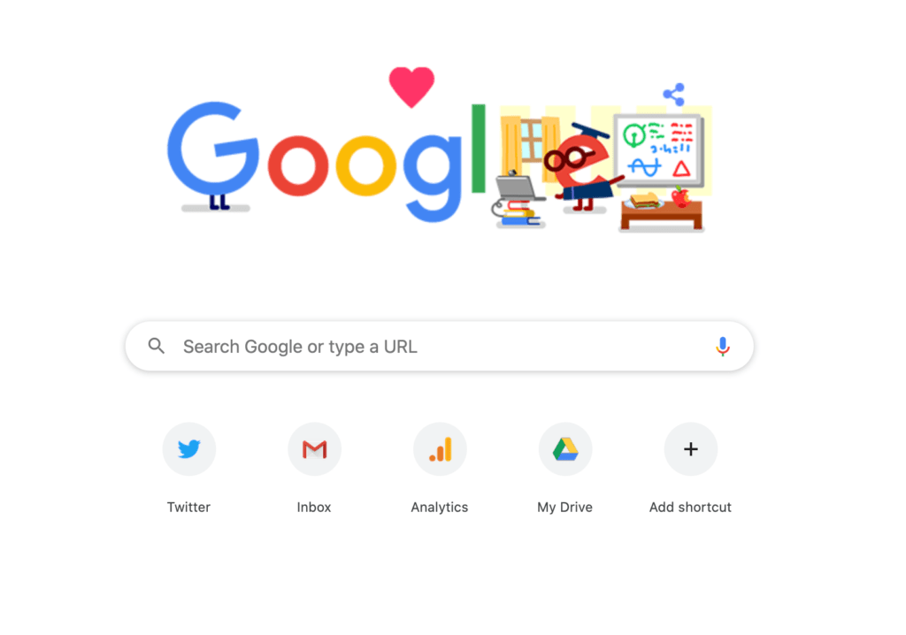

# Google Interface Project   &nbsp; 

> This is a simple project that recreates the Google Interface using HTML and CSS.

## Installation

To run this project locally, follow these steps:

-  Clone the repository to your local machine.
   git clone https://github.com/Sachin001s/google-interface-project.git

Navigate to the project directory.
- cd google-interface-project
- Open the index.html file in your web browser.

## Usage
Once you have opened the index.html file, you will see a web page that resembles the Google Interface. You can interact with the search bar, buttons, and other elements just like you would on the actual Google website.

Feel free to customize and modify the code in the index.html and style.css files to experiment with different designs or functionalities.

## Contributing
Contributions are welcome! If you have any improvements or suggestions, please open an issue or submit a pull request.
## License
This project is licensed under the [MIT](https://choosealicense.com/licenses/mit/) License.

